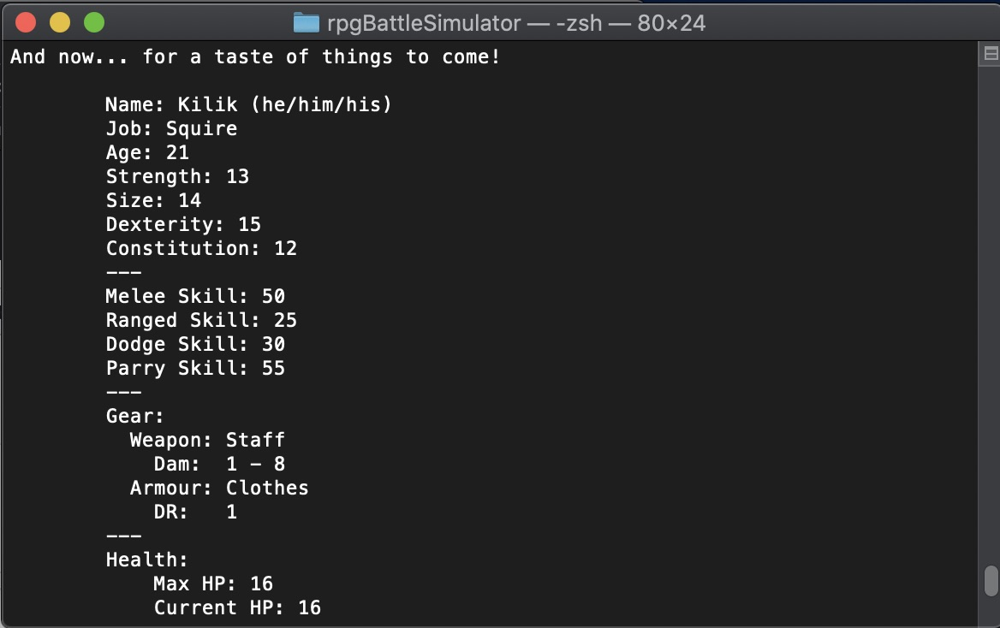

# rpgBattleSimulator - Super Hyper RPG Battledrome
[](https://opensource.org/licenses/MIT)

> Because the world will never have enough console-based RPG battle sims!

We did a segment in class in which we made an RPG-lite battle sim, and it made me think. I've made a thousand of these things over the years--who hasn't, right? But this is the first one I've ever done in JavaScript, so I was trying out some new things. JSON reference files, for one thing. Those are amazing! I wanted to make the basic module extensible, so I added external file support for several different areas of the game. Pretty cool. I still want to add JSON support for external narration files so the battle narrations don't get so stale.
The system underlying this is a variation on the rules for Basic Roleplaying by Chaosium, Inc., used in their iconic Call of Cthulu RPG. You can find their SRD here: 
[BRP SRD Homepage](https://www.chaosium.com/brp-system-reference-document/)

## User Story

```
AS AN RPG lover
I WANT a fun RPG sandbox to play around with
SO THAT I can try out cool coding ideas
```

```
GIVEN THAT the program runs in the console
WHEN I look at the modules in the program
THEN I see logical, ordered structure following an OOP model
WHEN I observe two elements interacting in the process
THEN I see separate and encapsulated pieces that handle their own processes with well-defined scope, independent of other elements
WHEN I need to add non-rule content to the game
THEN I can do it without having to interact with the code
```

## Graphic


## Table of Contents
* [Technologies](#Technologies)
* [Getting Started](#Getting)
* [Usage](#Usage)
* [Tests](#Running)
* [Project Status](#Project)
* [Questions](#Questions)
* [Contribuing](#Contributing)
* [License](#License)


## Technologies
JavaScript;
Node.js;
BRD System Reference Document;


## Getting Started
The class modules are in the ./js folder and the json files are in the ./reference folder, but the whole thing is too primitive to require any external dependencies, so there's no need to install anything. Just run it.


## Usage
```
node rpgBattle.js
```

All you have to do is run the file. It doesn't take any command line parameters at this time, although that would make a nice feature for the future.




## Running the Tests
I haven't had time to implement any tests yet, but I'm hoping to find time to add Jest support for the external modules and the dicebag class.


## Project Status
In progress


## Questions
Contact me by email or DM me to ask any questions about this project.


## Contributing
This is a personal experiment, and you're more than welcome to fork it and do your own thing with it. I have no plans to attempt to monetize it at this time.

## License
This project is licensed under the The MIT License.


### ionathas78

This file generated on 4/13/2020 by goodReadMeGenerator, copyright 2020 Jonathan Andrews
